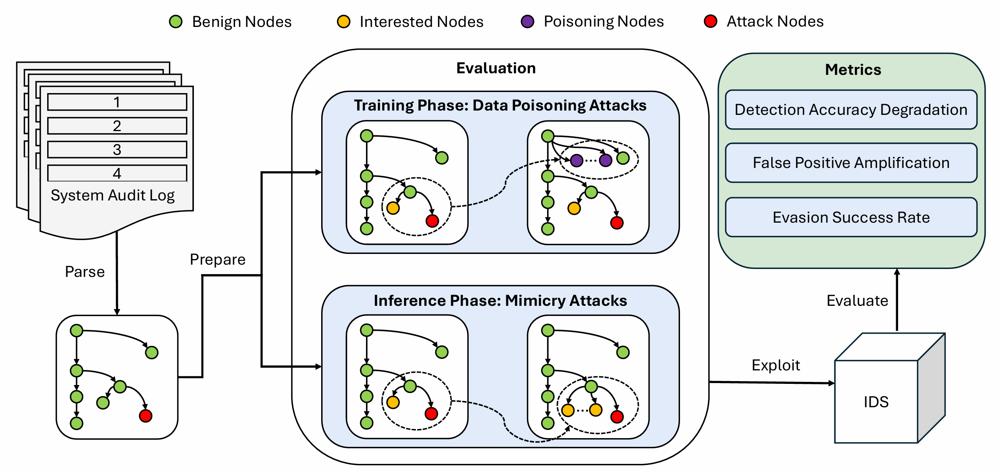

# Cerberus: A Comprehensive Framework for Evaluating the Robustness of Intrusion Detection Systems

Cerberus is an extensible, data-driven framework for evaluating the robustness of intrusion detection systems (IDS).  
It supports both DARPA CDM and ATLAS S1 datasets, provides flexible data poisoning and evasion evaluation modes, dictionary-based event filtering, and exports outputs in native formats. Cerberus also provides automated scripts for quantitative metrics evaluation in line with academic standards.


---

## Installation

Requires Python 3.7+ and numpy:

```bash
pip install numpy
```

---

## Dataset Preparation

### 1. DARPA CDM Dataset

- Place raw CDM event files (e.g. `ta1-trace-e3-official-1.json` and any split files) in `dataset/trace/`.
- Place the label file `lable.txt` (one malicious line number per line, starting from 1) in the same directory.

### 2. ATLAS S1 Dataset

- Place `firefox.txt`, `dns`, and `S1_number_.npy` (NumPy array with malicious line indices, 0-based) under `dataset/S1/logs/`.

### 3. Benign Event/Process Dictionary (Optional)

- Place event/process names (one per line) in `event_dictionary.txt` in the root directory.

---

## Running Cerberus

Cerberus supports training phase poisoning, inference (test) phase poisoning, or both.

**Basic usage:**

```bash
python cerberus.py --dataset trace --num 500 --mode both
```

**Key arguments:**

- `--dataset`    Dataset name: `trace` for DARPA, `S1` for ATLAS S1
- `--num`        Number of poisoning/insertion events (e.g. 100–1000)
- `--split`      Training/test split ratio (default: 0.7)
- `--mode`       Evaluation mode: `train` (poison training), `infer` (poison test), or `both`
- `--dict_filter` (optional): Only select events from `event_dictionary.txt` for insertion

**Example commands:**

- **DARPA, 500 poisoning events, dictionary filtering:**
  ```bash
  python cerberus.py --dataset trace --num 500 --mode both --dict_filter
  ```

- **S1, test set poisoning only:**
  ```bash
  python cerberus.py --dataset S1 --num 300 --mode infer
  ```

---

## Output Details

- **DARPA:**
  - Outputs `cerberus_train.json` and `cerberus_test.json` as JSON Lines (each line: raw event JSON)

- **ATLAS S1:**
  - Outputs in S1-native format under `dataset/S1/logs/`:
    - `cerberus_train_firefox.txt`, `cerberus_train_dns`
    - `cerberus_test_firefox.txt`, `cerberus_test_dns`
  - These files can be directly reused by S1 log analysis code.

---

## Evaluating Robustness Metrics

Cerberus includes scripts to calculate DAD, FPA, and ESR based on your model outputs. These scripts require both poisoned and baseline (clean) results as input.

## Using MAGIC and Airtag

You can directly use [MAGIC](https://github.com/FDUDSDE/MAGIC) and [Airtag](https://github.com/dhl123/Airtag-2023) with Cerberus output and metrics scripts.

### 1. Run MAGIC

- Refer to the [MAGIC repository](https://github.com/FDUDSDE/MAGIC) for installation and training instructions.
- After running MAGIC, **save the standard output** containing lines such as:
  ```
  TN: 615452
  FN: 14
  TP: 68072
  FP: 569
  ```
  to:
    - `magic_result.txt` (poisoned/attacked results)
    - `magic_baseline.txt` (clean/baseline results)

### 2. Run Airtag

- Refer to [Airtag's repository](https://github.com/dhl123/Airtag-2023) for installation and training.
- When running Airtag, save the output block containing:
  ```
  test1
  <TP>
  <FN>
  <FP>
  <TN>
  ```
  to:
    - `airtag_result.txt` (poisoned/attacked results)
    - `airtag_baseline.txt` (clean/baseline results)

---

## Calculating Metrics

Place the result files in the script directory, then run:

```bash
python magic_eval.py
python airtag_eval.py
```

The scripts will read both poisoned and baseline results and print the following metrics: **DAD, FPA, ESR**.

**Example output:**

```
=== magic Metrics ===
DAD: 0.012345
FPA: 0.058230
ESR: 0.003210
```

---

## Official References

- [MAGIC GitHub](https://github.com/FDUDSDE/MAGIC)
- [Airtag GitHub](https://github.com/dhl123/Airtag-2023)

---

**Cerberus: A Comprehensive Framework for Evaluating the Robustness of Intrusion Detection Systems.**
